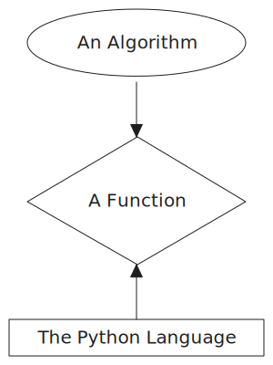

class: middle, center

<!-- this file is written for remark: https://github.com/gnab/remark/wiki -->

# Studying Algorithms

 
 

---

class: middle

## Agenda

- **Learning Objectives**

- **Behavior, Strategy, ~~Implementation~~**

- **An Algorithm-Studying Algorithm**

- **Recursion: _a review_**

- **Study-Along: _predictive stepping w/ visualizations_**

---

class: middle

## Learning Objectives

- **A structured process for studying algorithms**

- **Use Algorithm Visualizations for _Predictive Stepping_**

- **Refresh the 5 parts of a recursive algorithm**

  1. _Base Case_
  2. _Turn-Around_
  3. _Break-Down_
  4. _Recrusion_
  5. _Build-Up_

---

class: middle, center

## Behavior, Strategy, ~~Implementation~~

You _can_ understand an algorithm even if you can't write the code!

---

class: middle

## An Algorithm-Studying Algorithm

0. Describe the problem your algorithm solves, in your own words.

1. Describe how to know when the problem is solved, in your own words.

2. Describe input and output pairs. This can be with words, images, tests, ...

3. Practice solving some inputs by hand.

   - Find the solution however you can, don't worry about the algorithm!

4. _Predictive Step_ through the algorithm's visualization. (if you can find one.)

5. Study different _implementations_ of the algorithm by commenting their _strategy_.\*

6. Write your own solutions! Use full Test-Driven Development.\*

 

_\* Not covered in this workshop_

---

class: middle

## Recursion: _the 5 parts_

Recursion doesn't need to be mysterious or metaphorical!

All basic recursive strategies have these 5 parts.

- **Base Case**: The smallest version of the problem you are solving.

- **Turn-Around**: How you solve the base case.

- **Break-Down**: Create a smaller version of the problem from a bigger version.

- **Recursion**: Calling the function recursively with the smaller problem.

- **Build-Up**: Combining the smaller solution(s) to create a larger solution.

---

class: middle

## Study-Along

- [fibonacci](https://www.recursionvisualizer.com/?function_definition=def%20fibonacci%28n%3A%20int%29%20-%3E%20int%3A%0A%20%20%20%20if%20n%20%3C%3D%200%3A%20%20%23%20base%20case%201%0A%20%20%20%20%20%20%20%20return%200%20%20%23%20turn-around%201%0A%0A%20%20%20%20if%20n%20%3D%3D%201%3A%20%20%23%20base%20case%202%0A%20%20%20%20%20%20%20%20return%201%20%20%23%20turn-around%202%0A%0A%20%20%20%20left_recursion%20%3D%20fibonacci%28n%20-%201%29%0A%20%20%20%20right_recursion%20%3D%20fibonacci%28n%20-%202%29%0A%0A%20%20%20%20return%20left_recursion%20%2B%20right_recursion&function_call=fibonacci%284%29)

- [Binary Tree Traversal](https://algorithm-visualizer.org/brute-force/binary-tree-traversal)

- [Sorting](https://visualgo.net/en/sorting)

---

class: middle, center

# Thank You

 

---
